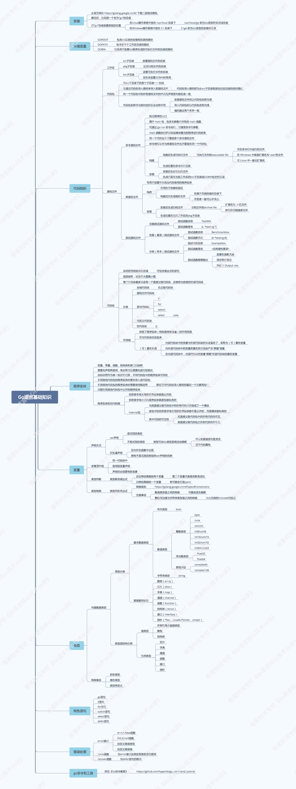

# learn go
```text
原文地址：https://time.geekbang.org/column/112

个人声明：
优秀的人帮我们总结了精华，而我之所以会写下来，一方面能加深我对知识的理解，另一方面也能够让我散发性思维思考。
此文不会用于商业用途，只是用于自我知识的积累。
```

## 1. 工作区 和 GOPATH
1.Go 语言安装
```bash 
tar xzf go1.10.3.linux-amd64.tar.gz -C /usr/local/  

chown -R root:root /usr/local/go

cat > /etc/profile.d/go.sh <<EOF
export GOROOT=/usr/local/go
export GOPATH=/Users/smallasa/Documents/github.com/learn_go
EOF

source /etc/profile  
```

2.Go 查看版本
```bash
liupengdeMBP:~ smallasa$ go version
go version go1.10.3 darwin/amd64
```

3.GOROOT GOPATH GOBIN  
```text
问题：设置GOPATH有什么意义？

GOPATH:
GOPATH的值可以是一个目录的路径,也可以包含多个目录路径，每个目录都代表Go语言的一个工作区。
这些工作区用于放置Go语言的源码文件(source file)，以及安装后的归档文件(archive file，也就是以".a"为扩展名的文件)
和可执行文件(executable file)。

Go语言项目在其生命周期内所有操作(编码、依赖管理、构建、测试、安装等)基本上都是围绕GOPATH和工作区进行的。


这个问题考察了4个知识点，分别是：

知识点1: Go语言的源码组织方式
Go语言是源码组织方式是以代码包为基础组织单位的。
一个代码包中可以包含任意个以.go为扩展名的源码文件，这些源码文件都需要被声明为属于同一个代码包。
代码包名称一般会与这些源码文件所在的目录同名。如果不同名，那么在构建、安装等过程中会以代码包名称为准。
每个代码包都有导入路径。代码包的导入路径是其它代码在使用该包中的程序实体时需要引入的路径。例如：
import 'github.com/labstack/echo'
在工作区中，一个代码包的导入路径实际上就是从src子目录，到该包的实际存储位置的相对路径。

所以说，Go语言源码的组织方式就是以环境变量GOPATH、工作区、src子目录、代码包为主线的。
一般情况下，Go语言的源码文件都需要被存放在环境变量GOPATH包含的某个工作区(目录)中的src目录下的某个代码包(目录)中。

知识点2: 了解源码安装后的结果
源码安装后，源码文件通常会被放在某个工作区的src子目录下；
如果安装后产生了归档文件，就会放到该工作区的pkg子目录；
如果产生了可执行文件，就会放到该工作区的bin子目录。

归档文件的具体位置和规则：
源码文件会以代码包的形式组织起来，一个代码包其实就应对一个目录。安装某个代码包而产生的归档文件是与这个代码包同名的。
例如：一个已经存在的代码包的导入路径是“github.com/labstack/echo”，
那么执行"go install github.com/labstack/echo"生成的归档文件目录就是"github.com/labstack"，文件名为"echo.a"。

归档文件的相对目录与pkg目录之间还有一级目录，叫做平台相关目录。
平台相关目录名称是由build的目标操作系统、下划线、目标计算机架构的代号组成。
比如：构建代码包时的操作系统时Linux，目标计算架构是64位，那么对应的平台相关目录就是linux_amd64
因此，归档文件就会被放置在当前工作区的子目录"pkg/linux_amd64/github.com/labstack"中。

知识点3: 理解构建和安装Go程序的过程
构建使用命令go build，安装使用命令go install。
构建和安装代码包的时候都会执行编译、打包等操作，并且这些操作生成的任何文件都会先被保存到某个临时的目录中。

如果构建的是库源码文件，那么操作的结果文件只会存在于临时目录中，这里的构建主要意义在于检查和验证。
如果构建的是命令源码文件，那么操作的结果文件会被保存到那个源码文件所在的目录中。

安装操作会先执行构建，然后还会进行链接操作，并且把结果文件保存到指定目录。
如果安装的是库源码文件，那么结果文件会保存到它所在工作区的pkg目录下的某个子目录中。
如果安装的是命令源码文件，那么结果文件会保存到它所在工作区的bin目录中，或环境变量GOBIN指向的目录中。

知识点4: go build命令点用途和用法
执行 go build 命令时，默认不会编译目标代码包所依赖的那些代码包。
但如果被依赖的代码包归档文件不存在，或者源码文件发生的变化，还是会被编译。

执行 go build -a 命令时，不但目标代码包总是会被编译，它依赖的代码包也总会被编译，即使依赖的是标准库中的代码包也是如此。
执行 go build -a -i 命令时，不但代码包被编译，还要安装它们的归档文件。
执行 go build -x 命令，可以看到go build具体都执行了哪些操作。
执行 go build -n 命令，只时查看具体操作但不执行它们。
执行 go build -a -v 命令，可以看到go build命令编译的代码包名称。

执行 go get 会自动从一些主流代码仓库下载目标代码包，并把它们安装到GOPATH包含到第1个工作区的相应目录中。
如果存在GOBIN，那么仅包含命令源码文件的代码包会被安装到GOBIN指向的目录中。

执行 go get -u 命令，下载并安装代码包，不管工作区是否已经存在。
执行 go get -d 命令，只下载代码包，不安装。
执行 go get -fix 命令，在下载代码包后先运行一个用于根据当前Go语言版本修正代码的工具，然后再安装代码包。
执行 go get -t 命令，同时下载测试所需的代码包。
执行 go get -insecure 命令，允许通过非安全的网络协议下载和安装代码包。http就是这样的协议。


有时候，我们可能出于某种目的变更存储源码的代码仓库或者代码包的相对路径。
这时，为了让代码包的远程导入路径不受此类变更的影响，我们会使用自定义的代码包导入路径。

对代码包的远程导入路径进行自定义的方法是：在该代码包中的库源文件的包声明语句的右边加入导入注释。例如：
package semaphore // import "golang.org/x/sync/semaphore"
这个代码包原本的完整导入路径是github.com/golang/sync/semaphore。
而加入导入注释后，就可以使用如下命令下载并安装该代码包了：
go get golang.org/x/sync/semaphore
```

4.思考
```text
1.Go语言在多个工作区中查找依赖包的时候是以怎样的顺序进行的？
GOPATH指向的目录，从上到下的顺序。

2.如果在多个工作区中都存在导入路径相同的代码包会产生冲突吗？
不会，因为查找代码包时时按照题1中的顺序，在哪找到就先用哪个。
```


## 2. 命令源码文件
我们已经知道，环境变量GOPATH指向的是一个或多个工作区，而每个工作区中都会有以代码包为基本组织形式的源码文件。
源码文件分为三种：命令源码文件、库源码文件、测试源码文件，它们都有不同的用途和编写规则。

1.命令源码文件的用途是什么？怎么编写它？  
```bash
命令源码文件是程序的运行入口，是每个可独立运行的程序必须拥有的。
我们可以通过构建或安装生成与其对应的可执行文件，后者一般会与该命令源码文件的直接父级目录同名。

例如：
liupengdeMBP:02 smallasa$ cat demo1.go
package main

import "fmt"

func main() {
    fmt.Println("Hello world!")
}

liupengdeMBP:02 smallasa$ go run demo1.go
Hello world!

如上，一个源码文件声明属于main包，并且包含一个无参数声明且无结果声明的main函数，那么就是命令源码文件。

当需要模块化编程时，我们往往会将代码拆分到多个文件，甚至拆分到不同的代码包中。
但无论怎么样，对于一个独立的程序来说，命令源码文件永远只会也只能有一个。
如果有与命令源码文件同包的源码文件，那么它们也应该声明属于main包。
```

2.命令源码文件怎么接收参数？
```bash
通过构建或安装命令源码文件生成的可执行文件就可以被称为"命令"，既然时命令，就应该具备接收参数的能力。

例如：
liupengdeMBP:02 smallasa$ cat demo2.go
package main

import (
    "flag"
    "fmt"
)

var name string

func init() {
    flag.StringVar(&name, "name", "everyone", "The greeting object.")
}

func main() {
    flag.Parse()
    fmt.Printf("Hello %s!\n", name)
}

如上，Go语言标准库中有一个代码包专门用于接收和解析命令参数，这个代码包的名字是flag。
如果想在代码中使用某个包中的程序实体，那么就应该先导入这个包。
首先，导入flag和fmt这两个个包
其次，人名肯定是字符串，定义变量name并声明类型
然后，调用flag.StringVar函数，它接收四个参数：
第1个参数，用于存储该命令参数的值的地址，这里就是前面声明的变量name，由表达式&name表示。
第2个参数，为了指定该命令参数的名称，这里是name。
第3个参数，为了指定在未追加该命令参数时的默认值，这里是everyone。
第4个参数，该命令参数的简短说明，在打印命令帮助时会用到。
最后，调用flag.Parse函数用于解析命令参数，并把它们的值赋值给相应的变量。

对函数的调用必须在所有命令参数存储载体的声明（这里是对变量name的声明）和设置（这里是对flag.StringVar函数调用之后），
并且在读取任何命令参数值之前进行。正因为如此，我们最好把flag.Parse()放在main函数的函数体第一行。
```

3.怎么在运行命令源码文件的时候传入参数？怎么查看参数的使用说明？
```bash
执行命令源码文件传入参数：
liupengdeMBP:02 smallasa$ go run demo2.go -name="penn"
Hello penn!

查看命令源码文件参数说明：
liupengdeMBP:02 smallasa$ go run demo2.go --help
Usage of /var/folders/qt/6fyvg7c10_79j503k00fz4600000gn/T/go-build129113399/b001/exe/demo2:
  -name string
    	The greeting object. (default "everyone")
exit status 2

Usage of /var/folders/qt/6fyvg7c10_79j503k00fz4600000gn/T/go-build129113399/b001/exe/demo2表示：
执行go run命令时，在构建上述命令源码文件时临时生成的可执行文件的完整路径。

先构建这个命令源码文件,再运行可执行文件：
liupengdeMBP:02 smallasa$ go build demo2.go
liupengdeMBP:02 smallasa$ ./demo2 -name="penn"
Hello penn!
```

4.怎么自定义命令源码文件的参数使用说明？
```bash
这有很多方式，最简单的一种方式就是对变量flag.Usage重新赋值。
flag.Usage对类型是func()，即一种无参数声明且无结果声明的函数类型。
注意，对flag.Usage的赋值必须在调用flag.Parse函数之前！

例如：
liupengdeMBP:02 smallasa$ cat demo3.go
package main

import (
    "os"
    "flag"
    "fmt"
)

var name string

func init() {
    flag.StringVar(&name, "name", "everyone", "The greeting object.")
}

func main() {
    flag.Usage = func() {
        fmt.Fprintf(os.Stderr, "Usage of %s:\n", "question")
        flag.PrintDefaults()
    }
    flag.Parse()
    fmt.Printf("Hello %s!\n", name)
}

liupengdeMBP:02 smallasa$ go run demo3.go --help
Usage of question:
  -name string
    	The greeting object. (default "everyone")
exit status 2


我们在调用flag包中的一些函数（比如StringVar、Parse等）的时候，实际上是在调用flag.CommandLine变量的方法。
flag.CommandLine相当于默认情况下的命令参数容器。
通过对flag.CommandLine重新赋值，我们可以更深层次的定制当前命令源码文件的参数使用说明。不再深入探讨。
```

5.思考
```text
1.默认情况下，我们可以让命令源码文件接收哪些类型的参数值？
liupengdeMBP:02 smallasa$ go doc flag|grep func|grep Var|awk '{print $2}'|awk -F '(' '{print $1}'|grep Var
BoolVar
DurationVar
Float64Var
Int64Var
IntVar
StringVar
Uint64Var
UintVar
Var
2.我们可以把自定义的数据类型作为参数值的类型吗？如果可以，怎么做？
```

6.知识补充
```txt
知识1：可以使用 go doc 或 godoc 命令查看命令帮助手册。
例如：
go doc fmt
godoc fmt

知识2：包的导入过程
程序的初始化和执行都起始于main包。如果main包还导入了其它的包，那么就会在编译时将它们依次导入。
有时一个包会被多个包同时导入，那么它只会被导入一次。
当一个包被导入时，如果该包还导入了其它的包，那么它会先将其它包导入进来，然后再对这些包中的包级常量和变量进行初始化，
接着执行init函数（如果存在），依次类推。等所有被导入的包都加载完毕后，就会开始对main包中的包级常量和变量进行初始化，
然后执行main包中的init函数（如果存在），最后执行main函数。

如下图：
```


## 3.库源码文件
库源码文件不能被直接运行，它仅用于存放程序实体。只要遵循go语言规范，这些程序实体就可以被其他代码使用。

1.程序实体是什么？
```text
在go语言中，它是变量、常量、函数、结构体和接口的统称。

我们总会先声明（或说定义）程序实体，然后再去使用。程序实体的名字被统一称为标识符。
标识符可以是任何Unicode编码表示的字母字符、数字、下划线'_'，但首字母不能是数字。
```

2.怎么把命令源码文件中的代码拆分到其它源码文件？
```bash
例如：
liupengdeMBP:03 smallasa$ cat demo4.go
package main

import (
    "flag"
)

var name string

func init() {
    flag.StringVar(&name, "name", "everyone", "The greeting object.")
}

func main() {
    flag.Parse()
    hello(name)
}

liupengdeMBP:03 smallasa$ cat demo4_lib.go
package main

import "fmt"

func hello(name string) {
    fmt.Printf("Hello, %s!\n", name)
}

liupengdeMBP:03 smallasa$ go run demo4.go demo4_lib.go
Hello, everyone!

如上，demo4.go和demo4_lib.go都声明自己属于main包。
源码文件声明的包名可以与其所在目录的名称不同，只要这些文件声明的包名一致就可以。
建议，在同一个目录下的源码文件都需要声明属于同一个代码包。

或者先编译后执行：
liupengdeMBP:03 smallasa$ go build ../03
liupengdeMBP:03 smallasa$ ./03
Hello, everyone!


代码包声明基本规则：
规则1：同目录下的源码文件的代码包声明语句要一致。
规则2：源码文件声明的代码包的名称可以与其所在的目录的名称不同。针对代码包构建时，生成结果文件的名称与其父目录名称一致。
```

3.怎么将源码文件中的代码拆分到其它代码包？
```bash
在编写真正的程序时，我们仅仅把代码拆分到几个源码文件中是不够的。
我们往往会使用模块化编程，根据代码的功能和用途把它们放置到不同的代码包中。

例如：
liupengdeMBP:learn_go smallasa$ mkdir -p src/demo/03/q2/lib/
liupengdeMBP:learn_go smallasa$ cat src/demo/03/q2/lib/demo5_lib.go
package lib5

import "fmt"

func Hello(name string) {
    fmt.Printf("Hello, %s!\n", name)
}

将demo5_lib.go源码文件的package main改为package lib5，同时将函数hello改为Hello。
```

4.基于3，思考一下，代码包的导入路径总会与其所在目录的相对路径一致吗？
```bash
库源码文件demo5_lib.go所在目录的相对路径是demo/03/q2/lib，而它却声明自己属于lib5包。
在这种情况下，该包导入路径是demo/03/q2/lib，还是demo/03/q2/lib5？

首先，我们构建或安装这个代码包：
liupengdeMBP:learn_go smallasa$ go install demo/03/q2/lib
liupengdeMBP:learn_go smallasa$ ls pkg/darwin_amd64/demo/03/q2/lib.a
pkg/darwin_amd64/demo/03/q2/lib.a

综上，我们会发现构建或安装代码包没有问题。
我们修改demo5.go源码文件，用于导入demo/03/q2/lib代码包，如下：
liupengdeMBP:learn_go smallasa$ cat  src/demo/03/q2/demo5.go
package main

import (
    "flag"
    "demo/03/q2/lib"
)

var name string

func init() {
    flag.StringVar(&name, "name", "everyone", "The greeting object.")
}

func main() {
    flag.Parse()
    lib.Hello(name)
}

liupengdeMBP:learn_go smallasa$ go run src/demo/03/q2/demo5.go
# command-line-arguments
src/demo/03/q2/demo5.go:5:5: imported and not used: "demo/03/q2/lib" as lib5
src/demo/03/q2/demo5.go:16:5: undefined: lib

如上，执行遇到两个错误：
第1个错误，我们导入了demo/03/q2/lib包，但没有使用其任何程序实体，这在go语言中是不允许的，在编译时导致失败。
另外，as lib5 说明，虽然导入了代码包demo/03/q2/lib，但在使用程序实体但时候应该是lib5，这就是第2个错误原因。

为什么会这样？
根本原因就是，我们在源码文件中声明所属的代码包与其所在目录的名称不同。

请记住：
源码文件所在的目录相对于src目录的相对路径就是它的代码包导入路径，
而实际使用程序实体时给定的限定符要与它声明所属的代码包名称对应。

我们将demo5_lib.go文件中的代码包声明改为package lib。我们应该让声明的包名与其父目录的名称一致。
如下：
liupengdeMBP:learn_go smallasa$ cat src/demo/03/q2/lib/demo5_lib.go
package lib

import "fmt"

func Hello(name string) {
    fmt.Printf("Hello, %s!\n", name)
}
liupengdeMBP:learn_go smallasa$ go run src/demo/03/q2/demo5.go
Hello, everyone!
```

5.基于3，思考一下，什么样的程序实体才可以被当前包外的代码引用？
```text
源码文件demo5_lib.go文件中的函数名hello为什么要大写？实际上涉及了Go语言中对程序实体访问权限对规则。

名称对首字母大写对程序实体才可以被当前包外对代码引用，否则它就只能被当前包内的其它代码引用。

通过名称，Go语言自然地把程序实体的访问权限划分为了包级私有的和公开的。
对于包级私有的程序实体，即使你导入了它所在的代码包，你也无法引用到它。
```

6.基于3，思考一下，对于程序实体，还有其它访问权限规则吗？
```text
答案是肯定的。
在1.5及后续版本中，我们可以通过创建internal代码包让一些程序实体仅仅能被当前模块中的其它代码引用。
这被称为Go程序实体的第三种访问权限：模块级私有。

具体规则是：
internal代码包中声明的公开程序实体仅能被该代码包的直接父级包及其子包中的代码引用。
当然，引用前需要先导入这个包。对于其它代码包，导入该internal包都是非法的，无法进行编译。
```

7.思考
```text
思考1：如果你需要导入两个代码包，而这两个代码包的最后一级是相同的，比如：dep/lib/flag 和 flag，会产生冲突吗？
如果包中声明的包名相同，肯定冲突
如果包中声明的包名不同，不会冲突

思考2：如果会产生冲突，怎么解决冲突？有几种方式？
方式一：在导入包的时候，设置别名，例如：import "f fmt"。
方式二：在导入包的时候，导入点操作，例如：import ". fmt",直接通过Printf调用，而不是fmt.Printf方式调用。
方式三：如果只想引入某包并没有在代码中实际调用则可以这么来避免冲突：import "_ fmt"
```

## 4.程序实体那些事儿（上）
Go语言中的程序实体包括变量、常量、函数、结构体和接口。
Go语言是静态类型的编程语言，所以我们在声明变量或常量的时候都需要指定它们的类型。

在Go语言中，变量的类型可以是其预定义的那些类型，也可以是自定义的函数、结构体或接口。

1.声明变量有几种方式？
```bash
例如：
liupengdeMBP:learn_go smallasa$ cat src/demo/04/demo7.go
package main

import (
    "flag"
    "fmt"
)

func main() {
    //方式一
    var name string
    flag.StringVar(&name, "name", "everyone", "The greeting object.")
    flag.Parse()
    //方式二
    var name = *flag.String("name", "everyone", "The greeting object.")
    //方式三
    name := *flag.String("name", "everyone", "The greeting object.")

    fmt.Printf("Hello %s!\n", name)
}

声明变量有两种典型方式，如下：
方式一 改为 方式二：
我在调用flag.String函数的代码左边加来一个星号"*"，这时因为该函数返回的结果值类型是*string而不是string。
类型*string代表的是字符串指针类型，而不是字符串类型。
这里只需要知道，通过一个星号把这个字符串的指针指向的字符串值取出来了，然后通过等号赋值给了name变量。

方式二 改为 方式三：
等号右边的代码不动，左边只保留name，在把"="改为":="。


方式二，在声明变量name的同时还为它赋了值，这时声明中并没有显式指定name的类型，这利用了Go语言自身的类型推断。
方式三，所用的是短变量声明，就是Go语言的类型推断再加上一点点语法糖。我们只能在函数体内部使用短变量声明。

简单的说，类型推断是一种编程语言在编译期自动解释表达式类型的能力；表达式类型就是表达式进行求值后得到结果的类型。
```

2.Go语言的类型推断可以带来哪些好处？
```bash
通过使用Go语言的类型推断，节省的键盘敲击数可以忽略不计，它真正的好处是写代码之后的事情，比如代码重构。

例如：
liupengdeMBP:learn_go smallasa$ cat  src/demo/04/demo8.go
package main

import (
    "flag"
    "fmt"
)

func main() {
    var name = getTheFlag()
    flag.Parse()
    fmt.Printf("Hello, %s!\n", *name)
}

func getTheFlag() *string {
    return flag.String("name", "everyone", "The greeting object.")
}

我们用getTheFlag函数包裹那个对flag.String函数对调用，并把其结果直接作为getTheFlag函数对结果，结果类型是*string。
这样，var name = 右边的表达式可以变为针对getTheFlag函数的调用表达式了。
这实际上是对声明并赋值name变量对那行代码的重构。
此时，你随意修改getTheFlag函数内部实现及其返回结果类型，而不用修改main函数中的任何代码。

我们通常把"不改变某个程序与外界的任何交互方式和规则，而只改变其内部实现"的代码修改方式，叫做该程序重构。

Go语言是静态类型的，所以一旦初始化变量时确定了它的类型，之后就不可能在改变。
通过代码重构方式，可以避免在后面维护程序的一些问题。
另外，这种类型的确定是在编译期完成的，因此不会对程序对执行效率产生任何影响。

Go语言类型推断可以明显提升程序对灵活性，使得代码重构变得更加容易，同时又不会给代码对维护带来额外负担，更不会损失运行效率。
```

3.变量的重声明是什么意思？
```bash
这涉及到了短变量声明。通过使用它，我们可以对同一个代码块中对变量进行重声明。

在Go语言中，代码块一般就是由花括号括起来对区域，里面可以包含表达式和语句。
Go语言本身以及我们编写对代码共同形成了一个非常大的代码块，也叫 全域代码块。

接下来，每个源码文件都是一个代码块，每个函数也是一个代码块，每个if语句、for语句、switch语句、select语句都是一个代码块。
甚至，switch和select语句中的case子句都是一个代码块。
走个极端，我就在main函数中写下一对紧挨着的花括号也是一个代码块，但我们称为空代码块。

变量重生明的前提条件：
条件1：由于变量的类型在其初始化时就已经确定了，所以对它再次声明时赋予的类型必须与其原本的类型相同，否则会编译错误。
条件2：变量的声明只可能发生在某一个代码块中。
条件3：变量的重声明只有在使用短变量声明时才发生，否则也无法通过编译。
条件4：被"声明并赋值"的变量必须是多个，并且其中至少有一个是新的变量。
```

4.总结
```text
在本小节中，我们聚焦于最基本的Go语言程序实体：变量。
并详细解说了变量声明和赋值的基本方法及其背后的重要概念和知识。

我们使用关键字var和短变量声明都可以实现对变量的“声明并赋值”。
前者可以用在任何地方；后者只能被用在函数或其它更小的代码块中。
但是，通过前者我们无法对已有的变量进行重声明，也就是说无法处理新旧变量混在一起的情况。
不过，它们都有一个共同点，即：基于类型判断
Go语言的类型推断只应用在了对变量或常量的初始化方面。
```

5.思考
```text
思考1：如果与当前的变量重名是外层代码块中的变量，这意味着什么？
这意味着，当前变量会覆盖外层代码块中的变量
```


## 5.程序实体那些事儿（中）
在上一节中，我们解释过代码块的含义，并由此引出了变量重声明方法和它的意义。

Go语言的代码块是一层套一层的，就像大圈套小圈。
一个代码块可以有若干个子代码块。但对每个代码块，最多只会有一个直接包含它的代码块，后者简称为前者的外层代码块。

代码块的划分间接地决定了其中程序实体的作用域。作用域是什么？  
我们都知道，**一个程序实体被创造出来大都是为了让别的代码引用**。比如，我声明一个变量是为了记录程序的一部分状态，
并通过查看它来决定程序下一步该做什么。这里的“记录”和“查看”肯定都是由别的代码实现的。
那么，什么样的代码可以引用这个变量？更具体地说，哪里的代码可以引用它？
我们前面说过，**程序的实体访问权限有三种：包级私有的、模块级私有的、模块级公开的。 
这其实就是Go语言在语言层面依据代码块对程序实体的作用域进行的定义。
前两种访问权限对应的都是代码包代码块，最后一种访问权限对应的是全局代码块。**  

然而，这个颗粒度是比较粗的，我们往往需要利用代码块再进行细化的程序实体作用域。
比如，我在一个函数中声明了一个变量，那么在通常情况下，这个变量是无法被该函数以外的代码引用的。
该函数就是一个代码块，而这个变量的作用域被限制在了该代码块中。  

总之，请记住，**一个程序实体的作用域总是会被限制在某个代码块中。而这个作用域最大的用处，就是对程序实体的访问权限控制。**
对“高内聚，低耦合”这种程序设计思想的实践恰恰可以从这里开始。  

1.如果一个变量与其外层代码块中的变量重名会出现什么状况？
```bash
liupengdeMBP:learn_go smallasa$ cat src/demo/05/q1/demo10.go
package main

import (
    "fmt"
)

var block = "package"

func main() {
    block := "function"
    {
        block := "inner"
        fmt.Printf("The block is %s.\n", block)
    }
    fmt.Printf("The block is %s.\n", block)
}


这段源码文件包含四个代码块：全局代码块、main包代码块、main函数代码块、在main函数中一个用花括号括起来的代码块。
我在后面三个代码块中分别声明了一个block变量，分别把字符串“package”，“function”，“inner”赋值给它们。
此外，我在后面两个代码块中分别使用fmt.Printf函数打印出它们。

判断一：该源码文件中的代码能编译吗？
能通过编译，输出结果为：
liupengdeMBP:learn_go smallasa$ go run  src/demo/05/q1/demo10.go
The block is inner.
The block is function.

问题解析：
你可能会认为它无法通过编译，因为有三处代码都声明了相同名称的变量。
的确，声明重名的变量是无法通过编译的，用短变量声明对已有变量进行声明除外，但这个只是对同一个代码块而言的。
对于不同代码块来说，其中的变量重名是没什么大不了的，照样可以通过编译。即使这些代码块有着直接嵌套关系也是如此。

判断二：引用的变量是哪一个？它的查找过程是什么？
这个查找过程不只针对变量，还适用于任何实体程序：
首先，代码引用变量的时候总会最优先查找当前代码块中的那个变量。
      注意，这里的“当前代码块”仅仅是引用变量的代码所在的那个代码块，并不包含任何子代码块。
其次，如果当前代码块中没有声明以此为名的变量，那么程序会沿着代码块的嵌套关系，
      从直接包含当前代码块的那个代码块开始，一层一层的向上查找。
最后，程序会一直查到当前代码包代表的那层代码块。如果仍然找不到，那么Go语言的编译器就会报错。
      注意，有个特殊情况，如果我们把代码包导入语句写成“import . xxx”的形式，
      那么就会让这个“xxx”包中公开的程序实体被当前源码文件中的代码视为当前代码包中的程序实体。
      在这个特殊情况下，程序在查找当前源码文件后先去查找这种方式导入的那些代码包。
```

2.不同代码块中的重名变量与变量重声明中的变量区别在哪？
```bash
注意：在同一个代码块中的变量不能出现重名的变量，这违背了Go语言语法。

我们暂时把“不同代码中的重名变量”称为“可重名变量”

区别：
1.变量重声明中的变量一定是在某一个代码块内。
  注意：这里的“某一个代码块”并不包含它的任何子代码块，否则就变成了“多个代码块之间”。
  可重名变量指的正是在多个代码块之间的由相同标识符代表的变量。

2.变量重声明是对同一个变量多次声明，这里的变量只有一个。
  可重名变量中涉及的变量肯定是多个的。

3.变量重声明不论对变量声明多少次，其类型必须始终一致，具体遵循第一次声明时给定的类型。
  可重名变量之间不存在类似限制，它们的类型是任意的。

4.如果可重名变量所在的代码块之间存在直接或间接的嵌套关系，那么它们之间一定会存在“屏蔽”现象。
  这种现象不会出现在重声明的场景下。  
  

我们应该尽量利用Go语言的语法、规范和命令来约束我们的程序。
例如:
liupengdeMBP:learn_go smallasa$ cat src/demo/05/q2/demo11.go
package main

import (
    "fmt"
)

var container = []string{"zero", "one", "two"}

func main() {
    container := map[int]string{0:"zero", 1:"one", 2:"two"}
    fmt.Printf("The block is %s.\n", container[1])
}

如上面代码，
有两个都叫container的变量，分别位于main包代码块和main函数代码块。
main包代码块中的变量是切片(slice)类型的，main函数代码块中的变量是字典(map)类型的。
最后，我试图打印出container变量的值中索引为1的那个元素。

如果你熟悉这两个类型肯定会知道，在它们的值上我们都可以施加索引表达式。
如果container的类型不是数组、切片或字典类型，那么那个索引表达式就会引发编译错误。
当我们想知道它的确切类型的时候，这种方式就不够了。
当可重名变量的值被转换成某个接口类型值，或者它们的类型本身就是接口类型的时候，严格的类型检查就很有必要了。
```

3.总结
```text
我们先讨论了代码块以及它与程序实体的作用域和访问权限控制之间的巧妙关系。
Go语言本身对程序实体提供了相对粗粒的访问控制，但我们自己可以利用代码块和作用域精细化控制它们。

如果在具有嵌套关系的不同代码块中存在重名变量，那么我们应该特别小心，它们之间可能会发生“屏蔽”现象。
这样你在不同代码块中引用到变量很可能是不同的。

另外，请记住变量重声明与可重名变量之间的区别以及它们的主要特征。
其中最容易产生隐晦问题的一点是，可重名变量可以各有各的类型。这时候我们往往应该在真正使用它们之前对其类型进行检查。
利用Go语言的语法、规范和命令做辅助的检查是很好的办法，但有些时候并不充分。
```

4.思考
```text
我们在讨论Go语言查找标识符时的范围的时候，提到过“import . xxx”这种导入代码包的方式。
请思考一下：
如果通过这种方式导入的代码包中的变量与当前代码包的变量重名了，那么Go语言是会把它们当作“可重名变量”看待还是会报错？

解答:
不会当作可重名变量对待，相反会当作变量重声明对待。会出现报错。
采用“import . xxx”导入方式，基本上就会认为引入的代码包的代码，如同在当前代码包中一样。
作用域都是在同一个代码包中，自然不允许重复声明。
```


## 6.程序实体那些事儿（下）
上一节，我们一直围绕可重名变量进行讨论。如果可重名变量类型不同，那就需要引起我们的注意，它们之间可能存在“屏蔽”现象。
必要的时候，我们需要严格检查它们的类型。

1.怎么判断一个变量的类型？
```bash
liupengdeMBP:learn_go smallasa$ cat src/demo/06/q1/demo11.go
package main

import (
    "fmt"
)

var container = []string{"zero", "one", "two"}


func main() {
    container := map[int]string{0:"zero", 1:"one", 2:"two"}
    fmt.Printf("The block is %s.\n", container[1])
}
```
以上面代码为例，在打印其中的元素之前，怎么正确判断container的类型？  
**答案是使用"类型断言"表达式。**   

例如：*value, ok := interface{}(container).([]string)*
这里有一条赋值语句。在赋值符号右边，是一个类型判断表达式。
**它包括了用来把container变量转换为空接口值的interface{}(container)，
和一个用于判断前者的类型是否为切片类型的[]string的.([]string)。**

这个表达式的结果可以被赋值给两个变量，这里由value和ok代表。变量ok是布尔类型，它将代表类型判断结果是true或者false。
如果ok的类型判断是true，那么被判断的值将会自动被转换为[]string类型的值，可以赋值给一个变量，在这里是value。
如果ok的类型判断是false，那么就会引发异常，这种异常在Go语言中被叫作panic，即运行时恐慌。
panic是一种在Go程序运行期间才会抛出的异常。除非显示的恢复这种"恐慌"，否则它会使Go程序崩溃并停止。
推荐使用带ok变量的写法。

正式说明一下，类型判断的语法形式是“**x.(T)**”。
其中，“x”代表要被判断类型的那个值。这个值当下的类型必须是接口类型的，不过具体是哪个接口类型其实无所谓。
所以，当这里的container变量类型不是任何的接口类型时，我们就需要把它转换成某个接口类型的值。
如果，container是某个接口类型的，那么这个类型断言表达式就可以是“container.([]string)”

在Go语言中，interface{}代表空接口，任何类型都是它的实现类型。现在你只需要知道，任何类型的值都可以很方便被转换成空接口的值就行了。

*你可能对这里的{}产生疑惑，为什么在关键字interface的右边还要加上花括号？*  
请记住：**一对不包含任何东西的花括号，除了可以代表空的代码块之外，还可以用于表示不包含任何内容的数据结构(或者说数据类型)**  
以后，你还会遇到“struct{}”，它代表了不包含任何字段和方法的、空的结构体类型。
“interface{}”则代表了不包含任何方法定义的、空的接口类型。
当然，对于一些集合的数据类型来说，“{}”还可以用来表示其值不包含任何元素，比如：空切片值[]string{}，空字典值map[int]string{}。

最右边圆括号中的“[]string”是一个类型字面量。所谓类型字面量，就是用来表示数据类型本身的若干个字符。
* string 表示字符串类型的字面量。
* uint8 表示8位无符号证书类型的字面量。
* []string 表示元素类型为string的切片类型。
* map[int]string 表示键类型为int、值类型为string的字典类型。

修改代码，增加类型判断:
```bash
liupengdeMBP:learn_go smallasa$ cat src/demo/06/q1/demo12.go
package main

import (
	"fmt"
)

var container = []string{"zero", "one", "two"}

func main() {
	container := map[int]string{0: "zero", 1: "one", 2: "two"}

	// 方式1。
	_, ok1 := interface{}(container).([]string)
	_, ok2 := interface{}(container).(map[int]string)
	if !(ok1 || ok2) {
		fmt.Printf("Error: unsupported container type: %T\n", container)
		return
	}
	fmt.Printf("The element is %q. (container type: %T)\n",
		container[1], container)

	// 方式2。
	elem, err := getElement(container)
	if err != nil {
		fmt.Printf("Error: %s\n", err)
		return
	}
	fmt.Printf("The element is %q. (container type: %T)\n",
		elem, container)
}

func getElement(containerI interface{}) (elem string, err error) {
	switch t := containerI.(type) {
	case []string:
		elem = t[1]
	case map[int]string:
		elem = t[1]
	default:
		err = fmt.Errorf("unsupported container type: %T", containerI)
		return
	}
	return
}
```

2.你认为类型转换规则中哪些值得注意的地方？  
类型转换表达式上面已经展示了。它的语法格式是“T(x)”。其中x可以是一个变量，也可以是一个代表值的字面量，还可以是一个表达式。

注意：如果是表达式，那么该表达式的结果只能是一个值，而不能是多个值。
在这个上下文中，x可以被叫作源值，它的类型就是源类型，而那个T代表的类型就是目标类型。
如果从源类型到目标类型的转换是不合法的，那么就会引发一个编译错误。可以查看Go语言规范中的[转换](https://golang.google.cn/ref/spec#Conversions)部分。

很多初学者所说的陷阱(或 坑)，大都源于他们需要了解但却不了解的那些知识和技巧。
因此，先抛出三个非常值得注意的知识点，帮助你标出一些“陷阱”:
* 首先，对于整数类型值、整数常量之间的类型转换，原则上值要源值在目标类型的可表示范围内就是合法的。
* 其次，虽然直接把一个整数类型转换为一个string类型的值是可行的，但值得关注的是，
被转换的整数值应该可以代表一个有效的Unicode代码点，否则转换的结果将会是“？”
* 最后，是关于string类型与各种切片类型之间的互转的。你要理解的是，一个值在从string类型向[]byte类型转换的时代表着
以UTF-8编码的字符串会被拆分成零散、独立的字节。其次，一个值在从string类型向[]rune类型转换时代表着字符串会被拆分成
一个个Unicode字符。

代码样例:
```bash
liupengdeMBP:learn_go smallasa$ cat src/demo/06/q2/demo13.go
package main

import (
	"fmt"
)

func main() {
	// 重点1的示例。
	var srcInt = int16(-255)
	// 请注意，之所以要执行uint16(srcInt)，是因为只有这样才能得到全二进制的表示。
	// 例如，fmt.Printf("%b", srcInt)将打印出"-11111111"，后者是负数符号再加上srcInt的绝对值的补码。
	// 而fmt.Printf("%b", uint16(srcInt))才会打印出srcInt原值的补码"1111111100000001"。
	fmt.Printf("The complement of srcInt: %b (%b)\n",
		uint16(srcInt), srcInt)
	dstInt := int8(srcInt)
	fmt.Printf("The complement of dstInt: %b (%b)\n",
		uint8(dstInt), dstInt)
	fmt.Printf("The value of dstInt: %d\n", dstInt)
	fmt.Println()

	// 重点2的示例。
	fmt.Printf("The Replacement Character: %s\n", string(-1))
	fmt.Printf("The Unicode codepoint of Replacement Character: %U\n", '�')
	fmt.Println()

	// 重点3的示例。
	srcStr := "你好"
	fmt.Printf("The string: %q\n", srcStr)
	fmt.Printf("The hex of %q: %x\n", srcStr, srcStr)
	fmt.Printf("The byte slice of %q: % x\n", srcStr, []byte(srcStr))
	fmt.Printf("The string: %q\n", string([]byte{'\xe4', '\xbd', '\xa0', '\xe5', '\xa5', '\xbd'}))
	fmt.Printf("The rune slice of %q: %U\n", srcStr, []rune(srcStr))
	fmt.Printf("The string: %q\n", string([]rune{'\u4F60', '\u597D'}))
}
```

3.什么是别名类型？什么是潜在类型？  
我们可以使用type声明自定义的各种类型。当然，这些类型必须在Go语言基本类型和高级类型的范畴之内。
在它们当中，有一种被叫作“别名类型”的类型。我们可以这样声明：  
```bash
type MyString = string
```
上面声明的语句表示，MyString是string类型的别名。别名类型与其源类型的区别只是在名字上不同，其余完全相同。
别名类型的存在，主要是为了代码重构。

Go语言内建的基本类型中就存在两个别名类型：byte是uint8的别名类型，rune是int32的别名类型。

一定要注意，如果我这样声明：
```bash
type MyString2 string
```
MyString2 和 string 是两个不同的类型，这里的MyString2是一个新的类型，不同于其它任何类型。
对于这里的类型再定义来说，string可以被称为MyString2的潜在类型。
**潜在类型的含义是某个类型在本质上是哪个类型或者是哪个类型的集合。
潜在类型相同的不同类型的值之间是可以进行类型转换的。**
因此，MyString2类型的值与string类型的值可以使用类型转换表达式进行互转。

但是，对于集合类的类型[]MyString2与[]string来说这样做却是不合法的，因为[]MyString2与[]string的潜在类型不同，分别是MyString2和string。
另外，即使两个类型的潜在类型相同，它们的值之间有而不能进行判断或比较，它们的变量之间也不能赋值。

4.总结  
在本小节中，我们聚焦于类型。Go语言中的每个变量都是有类型的，我们可以使用类型断言表达式判断变量是哪个类型的。
正确使用该表达式需要一些技巧，比如总是应该把结果赋给两个变量。另外还要保证被判断的变量是接口类型的，这可能会用到类型转换表达式。

我们在使用类型转换表达式对变量的类型进行转换的时候，会受到一套规则的严格约束。我们必须关注这套规则中的一些细节，尤其
是那些Go语言命令不会帮你检查的细节，否则就会踩进所谓的“陷阱”中。

此外，你还应该搞清楚别名类型声明与类型再定义之间的区别，以及由此带来的它们的值在类型转换、判断、比较和赋值操作方面的不同。


代码样例:
```bash
liupengdeMBP:learn_go smallasa$ cat src/demo/06/q3/demo14.go
package main

import "fmt"

func main() {
	// 示例1。
	{
		type MyString = string
		str := "BCD"
		myStr1 := MyString(str)
		myStr2 := MyString("A" + str)
		fmt.Printf("%T(%q) == %T(%q): %v\n",
			str, str, myStr1, myStr1, str == myStr1)
		fmt.Printf("%T(%q) > %T(%q): %v\n",
			str, str, myStr2, myStr2, str > myStr2)
		fmt.Printf("Type %T is the same as type %T.\n", myStr1, str)

		strs := []string{"E", "F", "G"}
		myStrs := []MyString(strs)
		fmt.Printf("A value of type []MyString: %T(%q)\n",
			myStrs, myStrs)
		fmt.Printf("Type %T is the same as type %T.\n", myStrs, strs)
		fmt.Println()
	}
	// 示例2。
	{
		type MyString string
		str := "BCD"
		myStr1 := MyString(str)
		myStr2 := MyString("A" + str)
		_ = myStr2
		//fmt.Printf("%T(%q) == %T(%q): %v\n",
		//	str, str, myStr1, myStr1, str == myStr1) // 这里的判等不合法，会引发编译错误。
		//fmt.Printf("%T(%q) > %T(%q): %v\n",
		//	str, str, myStr2, myStr2, str > myStr2) // 这里的比较不合法，会引发编译错误。
		fmt.Printf("Type %T is different from type %T.\n", myStr1, str)

		strs := []string{"E", "F", "G"}
		var myStrs []MyString
		//myStrs := []MyString(strs) // 这里的类型转换不合法，会引发编译错误。
		//fmt.Printf("A value of type []MyString: %T(%q)\n",
		//	myStrs, myStrs)
		fmt.Printf("Type %T is different from type %T.\n", myStrs, strs)
		fmt.Println()
	}
	// 示例3。
	{
		type MyString1 = string
		type MyString2 string
		str := "BCD"
		myStr1 := MyString1(str)
		myStr2 := MyString2(str)
		myStr1 = MyString1(myStr2)
		myStr2 = MyString2(myStr1)

		myStr1 = str
		//myStr2 = str // 这里的赋值不合法，会引发编译错误。
		//myStr1 = myStr2 // 这里的赋值不合法，会引发编译错误。
		//myStr2 = myStr1 // 这里的赋值不合法，会引发编译错误。
	}
}
```

5.思考
```text
1.你认为类型转换规则中还有哪些值得注意的地方？
解答:
* 接口之间的类型转换有时只有运行错误，不会有编译错误
* 正数的补码等于原码，负数的补码才是反码

2.你能具体说说别名类型在代码重构过程中可以起到哪些作用吗？
解答:
* 类型别名和原类型完全一样，可以随意命名，增加代码可读性
* 需要修改数据类型时，只用改定义的那一处地方
* 可以很方便的添加特有方法，以实现某些接口
```


## 7.数组和切片
通过上面的学习，我们已经对Go语言的开发环境配置、常用源码文件写法，以及程序实体（尤其是变量）及其
相关的各种概念和编程技巧（类型推断、变量重声明、可重名变量、类型断言、类型转换、别名类型和潜在类型）都有了一定的理解。
它们都是Go语言编程基础中比较重要的部分，同时也是后续文章的基石。

我们这次主要讨论Go语言的数组（array）和切片（slice）类型。它们都属于集合类型，它们的值也都可以用来存储某一种类型的值。
不过，它们最重要的不同是：  
* **数组类型的值的长度是固定的，而切片类型的值是可变长的。**
* **数组的长度在声明它的时候就必须被给定，并且在这之后不会再改变。可以说，数组的长度是其类型的一部分。
而切片的长度可以自动的随着其中的元素增长而增长。切片只有其元素的类型，没有其长度。**

我们可以把切片看做是对数组的一层简单封装，因为在每个切片的底层数据结构中，一定会包含一个数组。
后者可以被叫作前者的底层数组，而前者也可以被看作是对后者的某个连续片段的引用。
也正因为如此，**Go语言的切片类型属于引用类型，同属引用类型的还有后面会降到的字典类型、通道类型、函数类型等；
而Go语言的数组类型则属于值类型，同属值类型的有基础数据类型以及结构体类型。**

注意:**Go语言不存在像Java等编程语言那种令人困惑的“传值或传引用”问题。
在Go语言中，我们判断所谓的“传值”或者“传引用”只要看被传递的值的类型就好了。
如果传递的值的类型是引用类型的，那么就是“传引用”。
如果传递的值的类型是值类型的，那么就是“传值”。
从传递成本角度讲，引用类型的值往往要比值类型的值低很多。**

我们在数组和切片之上都可以应用索引表达式，得到的都会是某个元素。
我们在它们之上都可以应用切片表达式，也都会得到一个新的切片。
通过调用内建函数len，我们可以得到它们的长度；通过调用内建函数cap，我们可以得到它们的容量。
但需要注意，**数组的容量永远等于其长度，都是不可变的。而切片的容量却不是这样，并且它的变化是有规律可寻的。**

1.怎样正确估算切片的长度和容量？
```bash
liupengdeMBP:learn_go smallasa$ cat src/demo/07/q1/demo15.go
package main

import "fmt"

func main() {
    s1 := make([]int, 5)
    fmt.Printf("The length of s1: %d\n", len(s1))
    fmt.Printf("The capacity of s1: %d\n",cap(s1))
    fmt.Printf("The value os s1: %d\n", s1)

    fmt.Println()

    s2 := make([]int, 5, 8)
    fmt.Printf("The length of s2: %d\n", len(s2))
    fmt.Printf("The capacity of s2: %d\n",cap(s2))
    fmt.Printf("The value os s2: %d\n", s2)
}

liupengdeMBP:learn_go smallasa$ go run src/demo/07/q1/demo15.go
The length of s1: 5
The capacity of s1: 5
The value os s1: [0 0 0 0 0]

The length of s2: 5
The capacity of s2: 8
The value os s2: [0 0 0 0 0]
```
如上，首先，使用内建函数make声明了一个[]int类型的变量s1，传给make函数的第二个参数是5，从而指明了该切片的长度。
使用同样的方式声明了切片s2，只不过多传入了一个参数8，指明了该切片的容量。

为什么s1的容量是5呢？ 因为我们在声明s1的时候把它的长度设置成了5。
**当我们用make函数初始化切片时，如果不指明其容量，那么它就会和长度一致。
如果在初始化时指明了容量，那么切片的实际容量也就是它了。**

我们通过s2的再来明确一下长度、容量以及它们的关系：在初始化s2代表的切片时同时指定了它的长度和容量。
在这种情况下，它的容量实际上代表了它的底层数组的长度，这里是8。
注意：**切片底层数组等同于我们前面降到的数组，其长度不可变。**

你想象一下：有个窗口，你可以通过这个窗口看到一个数组，但是不一定能看到该数组中的所有元素，
有时候只能看到连续的一部分元素。现在，这个数组就是切片s2的底层数组，而这个窗口就是切片s2本身。
s2的长度实际上指明的就是这个窗口的宽度，决定了你透过s2可以看到其底层数组中的哪几个连续的元素。
由于s2的长度是5，所以你可以看到其底层数组中的第1个元素到第5个元素，对应的底层数组的索引范围是[0,4]。
切片代表的窗口也被划分成一个一个小格子，就像我们家里窗户那样。每个小格子都对应着其底层数组中的某一个元素。

我们继续以s2为例，这个窗口最左边的那个小格子对应的正好是其底层数组中的第一个元素，即索引为0的那个元素。
因此可以说，s2中的索引从0到4所指向的元素恰恰就是其底层数组中索引从0到4代表的那5个元素。

请记住，当我们用make函数或切片值字面量([]int{1,2,3})初始化一个切片时，该窗口最左边的那个小格子总是会对应其底层数组中的第一个元素。

当我们通过切片表达式基于某个数组或切片生成新切片的时候，情况就变得复杂了。例如：
```bash
liupengdeMBP:learn_go smallasa$ cat src/demo/07/q1/demo16.go
package main

import "fmt"

func main() {
    s3 := []int{1, 2, 3, 4, 5, 6, 7, 8}
    s4 := s3[3:6]
    fmt.Printf("The length of s4: %d\n", len(s4))
    fmt.Printf("The capacity of s4: %d\n", cap(s4))
    fmt.Printf("The value of s4: %d", s4)
}

liupengdeMBP:learn_go smallasa$ go run src/demo/07/q1/demo16.go
The length of s4: 3
The capacity of s4: 5
The value of s4: [4 5 6]
```
首先，s3中有8个元素，分别是从1到8的整数。s3的长度和容量都是8。  
然后，使用切片表达式s3[3:6]初始化了切片s4。  
最后，问题是s4的长度和容量分别是多少？  
要回答这个问题，首先你要知道，切片表达式中的方括号里面的那两个整数代表什么。
如果换一种表达方式，你或许会清楚，即[3,6)。这是数学中的区间表示方法，常用于表示取值范围。
由此可见，[3,6]要表达的就是s3中元素的索引范围从3到5(不包含6)。
这里的3可以被称为起始索引，6可以被称为i而结束索引。那么s4的长度就是6减3，即3。
因此可以说，s4中的索引从0到2指向的元素对应s3及其底层数组中索引从3到5的那3个元素。

切片的容量代表了它底层数组的长度，但这仅限于使用make函数或者切片值字面量初始化切片的情况。
更通用的规则是：**一个切片的容量可以被看作是透过这个窗口最多可以看到底层数组中元素的个数。**

由于s4是通过在s3上施加切片操作得来的，所以s3的底层数组就是s4的底层数组。
又因为，在底层数组不变的情况下，切片代表的窗口可以向右扩展，直至底层数组的末尾。
所以，s4的容量就是底层数组的长度8减去上述切片表达式中的那个起始索引3，即5。

注意，切片代表的窗口是无法向左扩展的。也就是说，我们永远无法透过s4看到s3中最左边的那3个元素。

最后，顺便提一下把切片窗口向右扩展到最大的方法。对于s4来说，切片表达式s4[0:cap(s4)]就可以做到。

2.怎样估算切片容量的增长？  
一旦一个切片无法容纳更多的元素，Go语言就会想办法扩容。但它并不会改变原来的切片，而是会生成一个容量更大的切片，
然后将把原有的元素和新元素一并拷贝到新切片中。

在一般情况下，你可以简单地认为新切片的容量将会是原有容量的2倍。
但是，当原切片的长度大于或等于1024时，Go语言将会以原容量的1.25倍作为新容量的基准。
新容量基准会被调整（不断的与1.25相乘），直到结果不小于原长度与要追加的元素数量之和。
最终，新容量往往会比新长度大一些，当然，相等也是由可能的。
另外，如果我们一次性追加的元素过多，以至于使新长度比原容量的2倍还要大，那么新容量就会以新长度为基准。

3.切片的底层数组什么时候会被替换？  
确切的说，一个切片的底层数组永远不会被替代。为什么？虽然在扩容的时候Go语言一定会生成新的底层数组，
但是它也同时生成了新的切片。它是把新的切片作为了新底层数组的窗口，而没有对原切片及其底层数组做任何改动。

请记住，在无需扩容时，append函数返回的是指向原底层数组的新切片；而在需要扩容时，append函数返回的是指向新底层数组的新切片。
顺便说一下，**只要新长度不会超过切片的原容量，那么使用append函数对其追元素的时候就不会引起扩容。
这只会使紧邻切片窗口右边的元素被新的元素替换掉。**

4.总结  
我们探讨了数组和切片以及它们之间的关系。切片时基于数组的、可变长的，并且非常轻快。
一个切片的容量总是固定的，而且一个切片也只会与某一个底层数组绑定在一起。
此外，切片的容量总是在切片的长度和底层数组长度之间的某一个值，并且还与切片窗口最左边对应的元素在底层数组中的位置有关系。
那两个分别用减法计算切片长度和容量的方法你一定要记住。另外，append函数总会返回新的切片，
而且如果新切片的容量比原切片的容量大，那么意味着底层数组也是新的了。

5.思考  
```text
1.如果有多个切片指向了同一个底层数组，那么你认为应该注意些什么？
初始时两个切片引用同一个底层数组，在后续操作中对某个切片的操作超出底层数组的容量时，这两个切片的引用就不是同一个数组了。
比如:
s1 := []int{1,2,3,4,5}
s2 := s1[0:5]

s2 = append(s2,6)
s1[3] = 30

此时，s1[3]的值为30，而s2[3]的值仍然为4，因为s3的底层数组已经是扩容后的数组了。

2.怎么沿用“扩容”的思想对切片进行“缩容”？请写出代码。
liupengdeMBP:learn_go smallasa$ cat src/demo/07/q1/demo17.go
package main

import "fmt"

func main() {
    s1 := []int{1,2,3,4,5}
    printSlice("s1", s1)

    fmt.Println()

    s1 = shrinkSlice(s1)
    printSlice("s1", s1)
}

func printSlice(s string, x []int){
    fmt.Printf("%s len=%d cap=%d %v\n", s, len(x), cap(x), x)
}

func shrinkSlice(x []int) []int {
    if (cap(x) > 0) {
        x = x[0:cap(x)-1]
    }
    return x
}
liupengdeMBP:learn_go smallasa$ go run src/demo/07/q1/demo17.go
s1 len=5 cap=5 [1 2 3 4 5]

s1 len=4 cap=5 [1 2 3 4]

注意：一切都从底层数组上找答案。
```


## 8.container包中的那些容器
我们上节讨论了数组和切片。切片本身有着占用内存少和创建便携等特点，但它但本质上还是数组。  

切片的一大好处是可以让我们通过窗口快速定位并获取，或者修改底层数组中的元素。
但是，当我们想删除切片中的元素时就没那么简单了。元素复制一般避免不了，就算是只删除一个元素，又是也会造成大量元素移动。
这时，还要注意空出的元素槽位的"清空"，否则很可能会造成内存泄露。

在新的切片被频繁的"扩容"的情况下，新的底层数组会不断产生，这时内存分配的量以及元素复制的次数可能就很可观了，
这时，肯定会对程序性能产生负面影响。尤其是当我们没有一个合理、有效"缩容"策略的时候，旧的底层数组无法被回收，
新的底层数组中也会有大量无用的元素槽位。过度的内存浪费不但会降低程序的性能，还可能会使内存溢出，并导致程序崩溃。

数组的自身特点和适用场景都非常明显，切片也是一样。他们都是Go语言原生的数据结构，使用起来很方便，不过，
你的集合类工具不应该只有它们。

当我们提到数组的时候，往往会想起链表。Go语言链表实现在其标准库的container/list代码包中。
这个包，包含了两个公开的程序实体：List 和 Element。前者实现了一个双向链表，后者则代表了链表中的元素结构。

对比来看，一个链表所占用的内存空间，往往要比包含相同元素的数组所占的内存大得多。
由于其元素并不是连续存储的，所以相邻的元素之间需要互相保存对方的指针。
不但如此，每个元素还要存有它所属的那个链表但指针。
有了这些关联，链表的结构反到更简单了。它只持有头部元素（或称为根元素）基本上就可以了。
当然，为了防止不必要的遍历和计算，把链表的长度记录在内也是必须的。

List 和 Element 都是结构体类型。
**结构体类型有一个特点，那就是它们的零值都会是拥有其特定结构，但没有任何定制化内容的值，相当于一个空壳。**
这样，值中的字段也会被分别赋予各自类型的零值。广义来讲，所谓的零值就是只做了声明，
但还未做初始化的变量被给予缺省值。每个类型的零值都会依据该类型的特性而被设定。

比如：
"var a [2]int"声明的变量a的值将会是一个包含两个0的整数数组；
"var s []int"声明的变量s的值将会是一个[]int类型的、值为nil的切片。

那么，"var l list.List"声明的变量l的值将会是什么？
这个零值将会是一个长度为0的链表。
这个链表持有的根元素也将会是一个空壳，其中值会包含缺省的内容。

那这样的链表我们可以拿来用吗？
答案是肯定的，可以拿来使用。这被称为"开箱即用"。
Go语言标准库中很多结构体类型的程序实体，都做到了开箱即用。这也是在编写可供别人使用的代码包时我们推荐遵循的最佳实践之一。

问题：可以把自己生成的Element类型值传给链表吗？  
List有 MoveBefore 和 MoveAfter 方法，它们分别用于把给定的元素移动到另一个元素的前面和后面。  
List有 MoveToFront 和 MoveToBack 方法，它们分别用于把给定的元素移动到链表的最前端和最后端。   
在这些方法中，"给定的元素"都是*Element类型的，该类型是Element类型的指针类型，此类型的值就是元素的指针。
```bash
func (1 *List) MoveBefore(e, mark *Element)
func (1 *List) MoveAfter(e, mark *Element)

func (1 *List) MoveToFront(e *Element)
func (1 *List) MoveToBack(e *Element)
```
如果我们自己生成这样的值，然后把它作为"给定的元素"传给链表的这些方法，那会发生什么？  
这里一个典型的回答，不会接受，这些方法不会对链表做出任何改动。
因为我们自己生成的Element值并不在链表中，所以也就谈不上"在链表中移动元素"。
更何况链表不允许我们把自己生成的Element值插入其中。

问题解析：  
在List包含的方法中，用于插入新元素的那些方法都只接受interface{}类型的值。
这些方法在内部会使用Element值包装接收到的元素。
这样做正是为了避免直接使用我们自己生成的元素，主要原因是避免链表内部关联遭到外界破坏，
这对于链表本身以及我们这些使用者来说，都是有益的。

List的 Front 和 Back 方法分别用于获取链表中最前端和后端的元素。  
List的 InsertBefore 和 InsertAfter 方法分别用于在指定的元素之前和之后插入新元素。  
List的 PushFront 和 PushBack 方法则分别用于在链表的最前端和最后端插入新元素。
```bash
func (1 *List) Front() *Element
func (1 *List) Back() *Element

func (1 *List) InsertBefore(v interface{}, mark *Element) *Element
func (1 *List) InsertAfter(v interface{}, mark *Element) *Element

func (1 *List) PushFront(v interface{}) *Element
func (1 *List) PushBack(v interface{}) *Element
```
这些方法都会把一个Element值的指针作为结果返回，它们就是链表留给我们的安全"接口"。
拿到这些内部元素的指针，我们就可以去调用前面提到的那些用于移动元素的方法了。

1.为什么链表可以做到开箱即用？  
List这个结构体类型有两个字段，一个是Element类型的字段root，另一个是int类型的字段len。
前者代表的就是那个根元素，后者则是用于存储链表的长度。
注意，它们都是包级私有的，也就是说使用者无法查看和修改它们。

例如前面的例子：var l list.List  
如上，声明的l，其字段root和len都会被赋予相应的零值。
len的零值是0，正好可以表明该链表还未包含任何元素。
由于root是Element类型的，所以它的零值就是该类型的空壳，用字面量表示就是Element{}。

Element类型包含了几个包级私有的字段，分别用于存储前一个元素，后一个元素以及所属链表的指针值。
另外还有一个名叫Value的公开字段，该字段的作用就是持有元素的实际值，它是interface{}类型的。
在Element类型的零值中，这些字段的值都会是nil。

其实，单凭这样一个l是无法正常运作的，但关键不在这里，而在于它的"延迟初始化"机制。
你可以理解为把初始化操作延后，仅在实际需要的时候才进行。
延迟初始化的优点在于"延后"，它可以分散初始化操作带来的计算量和存储空间消耗。

例如，如果我们需要集中声明非常多的大容量切片的话，那么那时的CPU和内存空间使用量肯定会是激增，并且，
只有设法让其中的切片及其底层数组被回收，内存使用量才会有所降低。
如果数组是可以被延迟初始化的，那么计算量和存储空间压力就可以被分散到实际使用它们的时候。
这些数组被实际使用的实践越分散，延迟初始化带来的优势就会越明显。

延迟初始化的缺点恰恰也在于"延迟"，你可以想象一下，如果我在调用链表的每个方法的时候，
它们都需要先去判断链表是否已经被初始化，那这也是一个计算上的浪费。
在这些方法被非常频繁的调用情况下，这种浪费的影响也就显现了，程序的性能会降低。

在这里的链表实现中，一些方法是无需对是否初始化做判断的。比如：
Front方法和Back方法，一旦发现链表长度为0直接返回nil就好了；
在用于删除元素、移动元素，以及一些用于插入元素的方法中，只要判断一下传入的元素中指向所属链表指针，是否与当前链表指针相等就可以了，
如果不相等，就一定说明传入的元素不是这个链表中的，后续操作也就不用做了。反之，说明这个链表已经被初始化了。
原因在于，链表的PushFront方法、PushBack方法、PushBackList方法以及PushFrontList方法总会先判断链表的状态，
并在必要时进行初始化，这就是延迟初始化。
而且，我们在向一个空链表添加新的元素时，肯定会使用这四个方法中的一个，这时新元素中指向所属链表的指针，一定会被设定为当前链表的指针。
所以，指针相等是链表初始化的充分条件。

List利用了自身，以及Element在结构上的特点，巧妙地平衡了延迟初始化的优缺点，使得链表可以开箱即用，并且性能上达到最优。


2.Ring 和 List 的区别在哪？
container/ring包中的Ring类型实现的是一个循环链表，也就是我们俗称的环。
其实List在内部就是一个循环链表。它的根元素永远不会持有任何实际的元素值，而该元素的存在，就是为了连接这个循环表的首尾两端。
所以可以说，List的零值是一个只包含了根元素，但不包含任何实际元素值的空链表。

既然Ring和List在本质上都是循环链表，那么它们到底有什么不同？
* Ring类型的数据结构仅由它自身即可代表；而List类型则需要由它以及Element类型联合表示。
这是表示方式上的不同，也是结构复杂程度上的不同。
* 一个Ring类型的值严格来讲，只代表了其所属的循环链中的一个元素，而一个List类型的值则代表了一个完整的链表。
这是表示纬度上的不同。
* 在创建并初始化一个Ring值的时候，我们可以指定它包含的元素数量，但对一个List值来说，却不能这么做。
循环链表一旦被创建，其长度是不可变的。这是两个代码中的New函数在功能上的不同，也是两个类型在初始化值方面的第一个不同。
* 仅通过"var r ring.Ring"语句声明的r将会是一个长度为1的循环列表，而List类型的零值则是一个长度为0的链表。
别忘了List中的根元素不会持有实际的元素值，因此计算长度时不会包含它。这是两个类型在初始化值方面的第二个不同。
* Ring值的Len方法的算法复杂度是O(N)的，而List值的Len方法的复杂度是O(1)的。
这是两者在性能方面最显而易见的差别。
* 另外一些不同基本上是方法方面的了。

总结：  
本小节主要讨论了container/list包中链表的实现。我们提及了数组和切片在数据结构以及设计初衷和适用场景方面的明显不同，
也详细讲解了此链表的一些主要使用技巧和实现特点。由于此链表实现在内部就是一个循环链表，
所以我们还把它与container/ring包中的循环链表实现做了一番比较，这包括结构、初始化以及性能方面。


思考题：  
```bash
1.container/ring包中的循环链表适用场景有哪些？
2.你使用过container/heap包中的堆吗？它的适用场景又有哪些？
```


## 写给0基础入门的Go语言学习者
1.Go语言学习路线图


2.Go语言基础知识的导图
