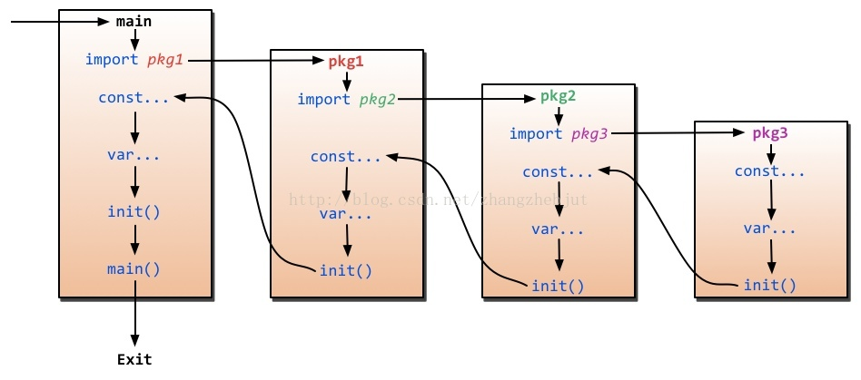
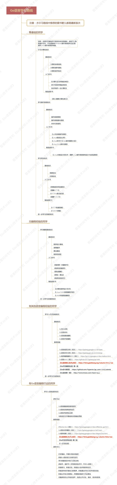
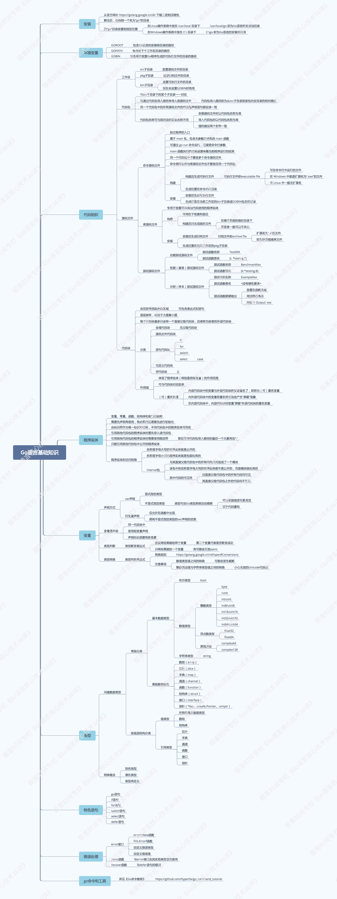

# learn go
```text
原文地址：https://time.geekbang.org/column/112

个人声明：
优秀的人帮我们总结了精华，而我之所以会写下来，一方面能加深我对知识的理解，另一方面也能够让我散发性思维思考。
此文不会用于商业用途，只是用于自我知识的积累。
```

## 1. 工作区 和 GOPATH
1.Go 语言安装
```bash 
tar xzf go1.10.3.linux-amd64.tar.gz -C /usr/local/  

chown -R root:root /usr/local/go

cat > /etc/profile.d/go.sh <<EOF
export GOROOT=/usr/local/go
export GOPATH=/Users/smallasa/Documents/github.com/learn_go
EOF

source /etc/profile  
```

2.Go 查看版本
```bash
liupengdeMBP:~ smallasa$ go version
go version go1.10.3 darwin/amd64
```

3.GOROOT GOPATH GOBIN  
```text
问题：设置GOPATH有什么意义？

GOPATH:
GOPATH的值可以是一个目录的路径,也可以包含多个目录路径，每个目录都代表Go语言的一个工作区。
这些工作区用于放置Go语言的源码文件(source file)，以及安装后的归档文件(archive file，也就是以".a"为扩展名的文件)
和可执行文件(executable file)。

Go语言项目在其生命周期内所有操作(编码、依赖管理、构建、测试、安装等)基本上都是围绕GOPATH和工作区进行的。


这个问题考察了4个知识点，分别是：

知识点1: Go语言的源码组织方式
Go语言是源码组织方式是以代码包为基础组织单位的。
一个代码包中可以包含任意个以.go为扩展名的源码文件，这些源码文件都需要被声明为属于同一个代码包。
代码包名称一般会与这些源码文件所在的目录同名。如果不同名，那么在构建、安装等过程中会以代码包名称为准。
每个代码包都有导入路径。代码包的导入路径是其它代码在使用该包中的程序实体时需要引入的路径。例如：
import 'github.com/labstack/echo'
在工作区中，一个代码包的导入路径实际上就是从src子目录，到该包的实际存储位置的相对路径。

所以说，Go语言源码的组织方式就是以环境变量GOPATH、工作区、src子目录、代码包为主线的。
一般情况下，Go语言的源码文件都需要被存放在环境变量GOPATH包含的某个工作区(目录)中的src目录下的某个代码包(目录)中。

知识点2: 了解源码安装后的结果
源码安装后，源码文件通常会被放在某个工作区的src子目录下；
如果安装后产生了归档文件，就会放到该工作区的pkg子目录；
如果产生了可执行文件，就会放到该工作区的bin子目录。

归档文件的具体位置和规则：
源码文件会以代码包的形式组织起来，一个代码包其实就应对一个目录。安装某个代码包而产生的归档文件是与这个代码包同名的。
例如：一个已经存在的代码包的导入路径是“github.com/labstack/echo”，
那么执行"go install github.com/labstack/echo"生成的归档文件目录就是"github.com/labstack"，文件名为"echo.a"。

归档文件的相对目录与pkg目录之间还有一级目录，叫做平台相关目录。
平台相关目录名称是由build的目标操作系统、下划线、目标计算机架构的代号组成。
比如：构建代码包时的操作系统时Linux，目标计算架构是64位，那么对应的平台相关目录就是linux_amd64
因此，归档文件就会被放置在当前工作区的子目录"pkg/linux_amd64/github.com/labstack"中。

知识点3: 理解构建和安装Go程序的过程
构建使用命令go build，安装使用命令go install。
构建和安装代码包的时候都会执行编译、打包等操作，并且这些操作生成的任何文件都会先被保存到某个临时的目录中。

如果构建的是库源码文件，那么操作的结果文件只会存在于临时目录中，这里的构建主要意义在于检查和验证。
如果构建的是命令源码文件，那么操作的结果文件会被保存到那个源码文件所在的目录中。

安装操作会先执行构建，然后还会进行链接操作，并且把结果文件保存到指定目录。
如果安装的是库源码文件，那么结果文件会保存到它所在工作区的pkg目录下的某个子目录中。
如果安装的是命令源码文件，那么结果文件会保存到它所在工作区的bin目录中，或环境变量GOBIN指向的目录中。

知识点4: go build命令点用途和用法
执行 go build 命令时，默认不会编译目标代码包所依赖的那些代码包。
但如果被依赖的代码包归档文件不存在，或者源码文件发生的变化，还是会被编译。

执行 go build -a 命令时，不但目标代码包总是会被编译，它依赖的代码包也总会被编译，即使依赖的是标准库中的代码包也是如此。
执行 go build -a -i 命令时，不但代码包被编译，还要安装它们的归档文件。
执行 go build -x 命令，可以看到go build具体都执行了哪些操作。
执行 go build -n 命令，只时查看具体操作但不执行它们。
执行 go build -a -v 命令，可以看到go build命令编译的代码包名称。

执行 go get 会自动从一些主流代码仓库下载目标代码包，并把它们安装到GOPATH包含到第1个工作区的相应目录中。
如果存在GOBIN，那么仅包含命令源码文件的代码包会被安装到GOBIN指向的目录中。

执行 go get -u 命令，下载并安装代码包，不管工作区是否已经存在。
执行 go get -d 命令，只下载代码包，不安装。
执行 go get -fix 命令，在下载代码包后先运行一个用于根据当前Go语言版本修正代码的工具，然后再安装代码包。
执行 go get -t 命令，同时下载测试所需的代码包。
执行 go get -insecure 命令，允许通过非安全的网络协议下载和安装代码包。http就是这样的协议。


有时候，我们可能出于某种目的变更存储源码的代码仓库或者代码包的相对路径。
这时，为了让代码包的远程导入路径不受此类变更的影响，我们会使用自定义的代码包导入路径。

对代码包的远程导入路径进行自定义的方法是：在该代码包中的库源文件的包声明语句的右边加入导入注释。例如：
package semaphore // import "golang.org/x/sync/semaphore"
这个代码包原本的完整导入路径是github.com/golang/sync/semaphore。
而加入导入注释后，就可以使用如下命令下载并安装该代码包了：
go get golang.org/x/sync/semaphore
```

4.思考
```text
1.Go语言在多个工作区中查找依赖包的时候是以怎样的顺序进行的？
GOPATH指向的目录，从上到下的顺序。

2.如果在多个工作区中都存在导入路径相同的代码包会产生冲突吗？
不会，因为查找代码包时时按照题1中的顺序，在哪找到就先用哪个。
```


## 2. 命令源码文件
我们已经知道，环境变量GOPATH指向的是一个或多个工作区，而每个工作区中都会有以代码包为基本组织形式的源码文件。
源码文件分为三种：命令源码文件、库源码文件、测试源码文件，它们都有不同的用途和编写规则。

1.命令源码文件的用途是什么？怎么编写它？  
```bash
命令源码文件是程序的运行入口，是每个可独立运行的程序必须拥有的。
我们可以通过构建或安装生成与其对应的可执行文件，后者一般会与该命令源码文件的直接父级目录同名。

例如：
liupengdeMBP:02 smallasa$ cat demo1.go
package main

import "fmt"

func main() {
    fmt.Println("Hello world!")
}

liupengdeMBP:02 smallasa$ go run demo1.go
Hello world!

如上，一个源码文件声明属于main包，并且包含一个无参数声明且无结果声明的main函数，那么就是命令源码文件。

当需要模块化编程时，我们往往会将代码拆分到多个文件，甚至拆分到不同的代码包中。
但无论怎么样，对于一个独立的程序来说，命令源码文件永远只会也只能有一个。
如果有与命令源码文件同包的源码文件，那么它们也应该声明属于main包。
```

2.命令源码文件怎么接收参数？
```bash
通过构建或安装命令源码文件生成的可执行文件就可以被称为"命令"，既然时命令，就应该具备接收参数的能力。

例如：
liupengdeMBP:02 smallasa$ cat demo2.go
package main

import (
    "flag"
    "fmt"
)

var name string

func init() {
    flag.StringVar(&name, "name", "everyone", "The greeting object.")
}

func main() {
    flag.Parse()
    fmt.Printf("Hello %s!\n", name)
}

如上，Go语言标准库中有一个代码包专门用于接收和解析命令参数，这个代码包的名字是flag。
如果想在代码中使用某个包中的程序实体，那么就应该先导入这个包。
首先，导入flag和fmt这两个个包
其次，人名肯定是字符串，定义变量name并声明类型
然后，调用flag.StringVar函数，它接收四个参数：
第1个参数，用于存储该命令参数的值的地址，这里就是前面声明的变量name，由表达式&name表示。
第2个参数，为了指定该命令参数的名称，这里是name。
第3个参数，为了指定在未追加该命令参数时的默认值，这里是everyone。
第4个参数，该命令参数的简短说明，在打印命令帮助时会用到。
最后，调用flag.Parse函数用于解析命令参数，并把它们的值赋值给相应的变量。

对函数的调用必须在所有命令参数存储载体的声明（这里是对变量name的声明）和设置（这里是对flag.StringVar函数调用之后），
并且在读取任何命令参数值之前进行。正因为如此，我们最好把flag.Parse()放在main函数的函数体第一行。
```

3.怎么在运行命令源码文件的时候传入参数？怎么查看参数的使用说明？
```bash
执行命令源码文件传入参数：
liupengdeMBP:02 smallasa$ go run demo2.go -name="penn"
Hello penn!

查看命令源码文件参数说明：
liupengdeMBP:02 smallasa$ go run demo2.go --help
Usage of /var/folders/qt/6fyvg7c10_79j503k00fz4600000gn/T/go-build129113399/b001/exe/demo2:
  -name string
    	The greeting object. (default "everyone")
exit status 2

Usage of /var/folders/qt/6fyvg7c10_79j503k00fz4600000gn/T/go-build129113399/b001/exe/demo2表示：
执行go run命令时，在构建上述命令源码文件时临时生成的可执行文件的完整路径。

先构建这个命令源码文件,再运行可执行文件：
liupengdeMBP:02 smallasa$ go build demo2.go
liupengdeMBP:02 smallasa$ ./demo2 -name="penn"
Hello penn!
```

4.怎么自定义命令源码文件的参数使用说明？
```bash
这有很多方式，最简单的一种方式就是对变量flag.Usage重新赋值。
flag.Usage对类型是func()，即一种无参数声明且无结果声明的函数类型。
注意，对flag.Usage的赋值必须在调用flag.Parse函数之前！

例如：
liupengdeMBP:02 smallasa$ cat demo3.go
package main

import (
    "os"
    "flag"
    "fmt"
)

var name string

func init() {
    flag.StringVar(&name, "name", "everyone", "The greeting object.")
}

func main() {
    flag.Usage = func() {
        fmt.Fprintf(os.Stderr, "Usage of %s:\n", "question")
        flag.PrintDefaults()
    }
    flag.Parse()
    fmt.Printf("Hello %s!\n", name)
}

liupengdeMBP:02 smallasa$ go run demo3.go --help
Usage of question:
  -name string
    	The greeting object. (default "everyone")
exit status 2


我们在调用flag包中的一些函数（比如StringVar、Parse等）的时候，实际上是在调用flag.CommandLine变量的方法。
flag.CommandLine相当于默认情况下的命令参数容器。
通过对flag.CommandLine重新赋值，我们可以更深层次的定制当前命令源码文件的参数使用说明。不再深入探讨。
```

5.思考
```text
1.默认情况下，我们可以让命令源码文件接收哪些类型的参数值？
liupengdeMBP:02 smallasa$ go doc flag|grep func|grep Var|awk '{print $2}'|awk -F '(' '{print $1}'|grep Var
BoolVar
DurationVar
Float64Var
Int64Var
IntVar
StringVar
Uint64Var
UintVar
Var
2.我们可以把自定义的数据类型作为参数值的类型吗？如果可以，怎么做？
```

6.知识补充
```txt
知识1：可以使用 go doc 或 godoc 命令查看命令帮助手册。
例如：
go doc fmt
godoc fmt

知识2：包的导入过程
程序的初始化和执行都起始于main包。如果main包还导入了其它的包，那么就会在编译时将它们依次导入。
有时一个包会被多个包同时导入，那么它只会被导入一次。
当一个包被导入时，如果该包还导入了其它的包，那么它会先将其它包导入进来，然后再对这些包中的包级常量和变量进行初始化，
接着执行init函数（如果存在），依次类推。等所有被导入的包都加载完毕后，就会开始对main包中的包级常量和变量进行初始化，
然后执行main包中的init函数（如果存在），最后执行main函数。

如下图：
```



## 3.库源码文件
库源码文件不能被直接运行，它仅用于存放程序实体。只要遵循go语言规范，这些程序实体就可以被其他代码使用。

1.程序实体是什么？
```text
在go语言中，它是变量、常量、函数、结构体和接口的统称。

我们总会先声明（或说定义）程序实体，然后再去使用。程序实体的名字被统一称为标识符。
标识符可以是任何Unicode编码表示的字母字符、数字、下划线'_'，但首字母不能是数字。
```

2.怎么把命令源码文件中的代码拆分到其它源码文件？
```bash
例如：
liupengdeMBP:03 smallasa$ cat demo4.go
package main

import (
    "flag"
)

var name string

func init() {
    flag.StringVar(&name, "name", "everyone", "The greeting object.")
}

func main() {
    flag.Parse()
    hello(name)
}

liupengdeMBP:03 smallasa$ cat demo4_lib.go
package main

import "fmt"

func hello(name string) {
    fmt.Printf("Hello, %s!\n", name)
}

liupengdeMBP:03 smallasa$ go run demo4.go demo4_lib.go
Hello, everyone!

如上，demo4.go和demo4_lib.go都声明自己属于main包。
源码文件声明的包名可以与其所在目录的名称不同，只要这些文件声明的包名一致就可以。
建议，在同一个目录下的源码文件都需要声明属于同一个代码包。

或者先编译后执行：
liupengdeMBP:03 smallasa$ go build ../03
liupengdeMBP:03 smallasa$ ./03
Hello, everyone!


代码包声明基本规则：
规则1：同目录下的源码文件的代码包声明语句要一致。
规则2：源码文件声明的代码包的名称可以与其所在的目录的名称不同。针对代码包构建时，生成结果文件的名称与其父目录名称一致。
```

3.怎么将源码文件中的代码拆分到其它代码包？
```bash
在编写真正的程序时，我们仅仅把代码拆分到几个源码文件中是不够的。
我们往往会使用模块化编程，根据代码的功能和用途把它们放置到不同的代码包中。

例如：
liupengdeMBP:learn_go smallasa$ mkdir -p src/demo/03/q2/lib/
liupengdeMBP:learn_go smallasa$ cat src/demo/03/q2/lib/demo5_lib.go
package lib5

import "fmt"

func Hello(name string) {
    fmt.Printf("Hello, %s!\n", name)
}

将demo5_lib.go源码文件的package main改为package lib5，同时将函数hello改为Hello。
```

4.基于3，思考一下，代码包的导入路径总会与其所在目录的相对路径一致吗？
```bash
库源码文件demo5_lib.go所在目录的相对路径是demo/03/q2/lib，而它却声明自己属于lib5包。
在这种情况下，该包导入路径是demo/03/q2/lib，还是demo/03/q2/lib5？

首先，我们构建或安装这个代码包：
liupengdeMBP:learn_go smallasa$ go install demo/03/q2/lib
liupengdeMBP:learn_go smallasa$ ls pkg/darwin_amd64/demo/03/q2/lib.a
pkg/darwin_amd64/demo/03/q2/lib.a

综上，我们会发现构建或安装代码包没有问题。
我们修改demo5.go源码文件，用于导入demo/03/q2/lib代码包，如下：
liupengdeMBP:learn_go smallasa$ cat  src/demo/03/q2/demo5.go
package main

import (
    "flag"
    "demo/03/q2/lib"
)

var name string

func init() {
    flag.StringVar(&name, "name", "everyone", "The greeting object.")
}

func main() {
    flag.Parse()
    lib.Hello(name)
}

liupengdeMBP:learn_go smallasa$ go run src/demo/03/q2/demo5.go
# command-line-arguments
src/demo/03/q2/demo5.go:5:5: imported and not used: "demo/03/q2/lib" as lib5
src/demo/03/q2/demo5.go:16:5: undefined: lib

如上，执行遇到两个错误：
第1个错误，我们导入了demo/03/q2/lib包，但没有使用其任何程序实体，这在go语言中是不允许的，在编译时导致失败。
另外，as lib5 说明，虽然导入了代码包demo/03/q2/lib，但在使用程序实体但时候应该是lib5，这就是第2个错误原因。

为什么会这样？
根本原因就是，我们在源码文件中声明所属的代码包与其所在目录的名称不同。

请记住：
源码文件所在的目录相对于src目录的相对路径就是它的代码包导入路径，
而实际使用程序实体时给定的限定符要与它声明所属的代码包名称对应。

我们将demo5_lib.go文件中的代码包声明改为package lib。我们应该让声明的包名与其父目录的名称一致。
如下：
liupengdeMBP:learn_go smallasa$ cat src/demo/03/q2/lib/demo5_lib.go
package lib

import "fmt"

func Hello(name string) {
    fmt.Printf("Hello, %s!\n", name)
}
liupengdeMBP:learn_go smallasa$ go run src/demo/03/q2/demo5.go
Hello, everyone!
```

5.基于3，思考一下，什么样的程序实体才可以被当前包外的代码引用？
```text
源码文件demo5_lib.go文件中的函数名hello为什么要大写？实际上涉及了Go语言中对程序实体访问权限对规则。

名称对首字母大写对程序实体才可以被当前包外对代码引用，否则它就只能被当前包内的其它代码引用。

通过名称，Go语言自然地把程序实体的访问权限划分为了包级私有的和公开的。
对于包级私有的程序实体，即使你导入了它所在的代码包，你也无法引用到它。
```

6.基于3，思考一下，对于程序实体，还有其它访问权限规则吗？
```text
答案是肯定的。
在1.5及后续版本中，我们可以通过创建internal代码包让一些程序实体仅仅能被当前模块中的其它代码引用。
这被称为Go程序实体的第三种访问权限：模块级私有。

具体规则是：
internal代码包中声明的公开程序实体仅能被该代码包的直接父级包及其子包中的代码引用。
当然，引用前需要先导入这个包。对于其它代码包，导入该internal包都是非法的，无法进行编译。
```

7.思考
```text
思考1：如果你需要导入两个代码包，而这两个代码包的最后一级是相同的，比如：dep/lib/flag 和 flag，会产生冲突吗？
如果包中声明的包名相同，肯定冲突
如果包中声明的包名不同，不会冲突

思考2：如果会产生冲突，怎么解决冲突？有几种方式？
方式一：在导入包的时候，设置别名，例如：import "f fmt"。
方式二：在导入包的时候，导入点操作，例如：import ". fmt",直接通过Printf调用，而不是fmt.Printf方式调用。
方式三：如果只想引入某包并没有在代码中实际调用则可以这么来避免冲突：import "_ fmt"
```

## 4.程序实体那些事儿（上）
Go语言中的程序实体包括变量、常量、函数、结构体和接口。
Go语言是静态类型的编程语言，所以我们在声明变量或常量的时候都需要指定它们的类型。

在Go语言中，变量的类型可以是其预定义的那些类型，也可以是自定义的函数、结构体或接口。

1.声明变量有几种方式？
```bash
例如：
liupengdeMBP:learn_go smallasa$ cat src/demo/04/demo7.go
package main

import (
    "flag"
    "fmt"
)

func main() {
    //方式一
    var name string
    flag.StringVar(&name, "name", "everyone", "The greeting object.")
    flag.Parse()
    //方式二
    var name = *flag.String("name", "everyone", "The greeting object.")
    //方式三
    name := *flag.String("name", "everyone", "The greeting object.")

    fmt.Printf("Hello %s!\n", name)
}

声明变量有两种典型方式，如下：
方式一 改为 方式二：
我在调用flag.String函数的代码左边加来一个星号"*"，这时因为该函数返回的结果值类型是*string而不是string。
类型*string代表的是字符串指针类型，而不是字符串类型。
这里只需要知道，通过一个星号把这个字符串的指针指向的字符串值取出来了，然后通过等号赋值给了name变量。

方式二 改为 方式三：
等号右边的代码不动，左边只保留name，在把"="改为":="。


方式二，在声明变量name的同时还为它赋了值，这时声明中并没有显式指定name的类型，这利用了Go语言自身的类型推断。
方式三，所用的是短变量声明，就是Go语言的类型推断再加上一点点语法糖。我们只能在函数体内部使用短变量声明。

简单的说，类型推断是一种编程语言在编译期自动解释表达式类型的能力；表达式类型就是表达式进行求值后得到结果的类型。
```

2.Go语言的类型推断可以带来哪些好处？
```bash
通过使用Go语言的类型推断，节省的键盘敲击数可以忽略不计，它真正的好处是写代码之后的事情，比如代码重构。

例如：
liupengdeMBP:learn_go smallasa$ cat  src/demo/04/demo8.go
package main

import (
    "flag"
    "fmt"
)

func main() {
    var name = getTheFlag()
    flag.Parse()
    fmt.Printf("Hello, %s!\n", *name)
}

func getTheFlag() *string {
    return flag.String("name", "everyone", "The greeting object.")
}

我们用getTheFlag函数包裹那个对flag.String函数对调用，并把其结果直接作为getTheFlag函数对结果，结果类型是*string。
这样，var name = 右边的表达式可以变为针对getTheFlag函数的调用表达式了。
这实际上是对声明并赋值name变量对那行代码的重构。
此时，你随意修改getTheFlag函数内部实现及其返回结果类型，而不用修改main函数中的任何代码。

我们通常把"不改变某个程序与外界的任何交互方式和规则，而只改变其内部实现"的代码修改方式，叫做该程序重构。

Go语言是静态类型的，所以一旦初始化变量时确定了它的类型，之后就不可能在改变。通过代码重构方式，可以避免在后面维护程序的一些问题。
另外，这种类型的确定是在编译期完成的，因此不会对程序对执行效率产生任何影响。

Go语言类型推断可以明显提升程序对灵活性，使得代码重构变得更加容易，同时又不会给代码对维护带来额外负担，更不会损失运行效率。
```

3.变量的重声明是什么意思？
```bash
这涉及到了短变量声明。通过使用它，我们可以对同一个代码块中对变量进行重声明。

在Go语言中，代码块一般就是由花括号括起来对区域，里面可以包含表达式和语句。
Go语言本身以及我们编写对代码共同形成了一个非常大的代码块，也叫 全域代码块。

接下来，每个源码文件都是一个代码块，每个函数也是一个代码块，每个if语句、for语句、switch语句、select语句都是一个代码块。
甚至，switch和select语句中的case子句都是一个代码块。
走个极端，我就在main函数中写下一对紧挨着的花括号也是一个代码块，但我们称为空代码块。

变量重生明的前提条件：
条件1：由于变量的类型在其初始化时就已经确定了，所以对它再次声明时赋予的类型必须与其原本的类型相同，否则会编译错误。
条件2：变量的声明只可能发生在某一个代码块中。
条件3：变量的重声明只有在使用短变量声明时才发生，否则也无法通过编译。
条件4：被"声明并赋值"的变量必须是多个，并且其中至少有一个是新的变量。
```

4.总结
```text
在本小节中，我们聚焦于最基本的Go语言程序实体：变量。
并详细解说了变量声明和赋值的基本方法及其背后的重要概念和知识。

我们使用关键字var和短变量声明都可以实现对变量的“声明并赋值”。
前者可以用在任何地方；后者只能被用在函数或其它更小的代码块中。
但是，通过前者我们无法对已有的变量进行重声明，也就是说无法处理新旧变量混在一起的情况。
不过，它们都有一个共同点，即：基于类型判断
Go语言的类型推断只应用在了对变量或常量的初始化方面。
```

5.思考
```text
思考1：如果与当前的变量重名是外层代码块中的变量，这意味着什么？
这意味着，当前变量会覆盖外层代码块中的变量
```


## 5.程序实体那些事儿（中）
在上一节中，我们解释过代码块的含义，并由此引出了变量重声明方法和它的意义。

Go语言的代码块是一层套一层的，就像大圈套小圈。
一个代码块可以有若干个子代码块。但对每个代码块，最多只会有一个直接包含它的代码块，后者简称为前者的外层代码块。

代码块的划分间接地决定了其中程序实体的作用域。作用域是什么？  
我们都知道，**一个程序实体被创造出来大都是为了让别的代码引用**。比如，我声明一个变量是为了记录程序的一部分状态，
并通过查看它来决定程序下一步该做什么。这里的“记录”和“查看”肯定都是由别的代码实现的。
那么，什么样的代码可以引用这个变量？更具体地说，哪里的代码可以引用它？
我们前面说过，**程序的实体访问权限有三种：包级私有的、模块级私有的、模块级公开的。 
这其实就是Go语言在语言层面依据代码块对程序实体的作用域进行的定义。
前两种访问权限对应的都是代码包代码块，最后一种访问权限对应的是全局代码块。**  

然而，这个颗粒度是比较粗的，我们往往需要利用代码块再进行细化的程序实体作用域。
比如，我在一个函数中声明了一个变量，那么在通常情况下，这个变量是无法被该函数以外的代码引用的。
该函数就是一个代码块，而这个变量的作用域被限制在了该代码块中。  

总之，请记住，**一个程序实体的作用域总是会被限制在某个代码块中。而这个作用域最大的用处，就是对程序实体的访问权限控制。**
对“高内聚，低耦合”这种程序设计思想的实践恰恰可以从这里开始。  

1.如果一个变量与其外层代码块中的变量重名会出现什么状况？
```bash
liupengdeMBP:learn_go smallasa$ cat src/demo/05/q1/demo10.go
package main

import (
    "fmt"
)

var block = "package"

func main() {
    block := "function"
    {
        block := "inner"
        fmt.Printf("The block is %s.\n", block)
    }
    fmt.Printf("The block is %s.\n", block)
}


这段源码文件包含四个代码块：全局代码块、main包代码块、main函数代码块、在main函数中一个用花括号括起来的代码块。
我在后面三个代码块中分别声明了一个block变量，分别把字符串“package”，“function”，“inner”赋值给它们。
此外，我在后面两个代码块中分别使用fmt.Printf函数打印出它们。

判断一：该源码文件中的代码能编译吗？
能通过编译，输出结果为：
liupengdeMBP:learn_go smallasa$ go run  src/demo/05/q1/demo10.go
The block is inner.
The block is function.

问题解析：
你可能会认为它无法通过编译，因为有三处代码都声明了相同名称的变量。
的确，声明重名的变量是无法通过编译的，用短变量声明对已有变量进行声明除外，但这个只是对同一个代码块而言的。
对于不同代码块来说，其中的变量重名是没什么大不了的，照样可以通过编译。即使这些代码块有着直接嵌套关系也是如此。

判断二：引用的变量是哪一个？它的查找过程是什么？
这个查找过程不只针对变量，还适用于任何实体程序：
首先，代码引用变量的时候总会最优先查找当前代码块中的那个变量。
      注意，这里的“当前代码块”仅仅是引用变量的代码所在的那个代码块，并不包含任何子代码块。
其次，如果当前代码块中没有声明以此为名的变量，那么程序会沿着代码块的嵌套关系，
      从直接包含当前代码块的那个代码块开始，一层一层的向上查找。
最后，程序会一直查到当前代码包代表的那层代码块。如果仍然找不到，那么Go语言的编译器就会报错。
      注意，有个特殊情况，如果我们把代码包导入语句写成“import . xxx”的形式，
      那么就会让这个“xxx”包中公开的程序实体被当前源码文件中的代码视为当前代码包中的程序实体。
      在这个特殊情况下，程序在查找当前源码文件后先去查找这种方式导入的那些代码包。
```

2.不同代码块中的重名变量与变量重声明中的变量区别在哪？
```bash
注意：在同一个代码块中的变量不能出现重名的变量，这违背了Go语言语法。

我们暂时把“不同代码中的重名变量”称为“可重名变量”

区别：
1.变量重声明中的变量一定是在某一个代码块内。
  注意：这里的“某一个代码块”并不包含它的任何子代码块，否则就变成了“多个代码块之间”。
  可重名变量指的正是在多个代码块之间的由相同标识符代表的变量。

2.变量重声明是对同一个变量多次声明，这里的变量只有一个。
  可重名变量中涉及的变量肯定是多个的。

3.变量重声明不论对变量声明多少次，其类型必须始终一致，具体遵循第一次声明时给定的类型。
  可重名变量之间不存在类似限制，它们的类型是任意的。

4.如果可重名变量所在的代码块之间存在直接或间接的嵌套关系，那么它们之间一定会存在“屏蔽”现象。
  这种现象不会出现在重声明的场景下。  
  

我们应该尽量利用Go语言的语法、规范和命令来约束我们的程序。
例如:
liupengdeMBP:learn_go smallasa$ cat src/demo/05/q2/demo11.go
package main

import (
    "fmt"
)

var container = []string{"zero", "one", "two"}

func main() {
    container := map[int]string{0:"zero", 1:"one", 2:"two"}
    fmt.Printf("The block is %s.\n", container[1])
}

如上面代码，
有两个都叫container的变量，分别位于main包代码块和main函数代码块。
main包代码块中的变量是切片(slice)类型的，main函数代码块中的变量是字典(map)类型的。
最后，我试图打印出container变量的值中索引为1的那个元素。

如果你熟悉这两个类型肯定会知道，在它们的值上我们都可以施加索引表达式。
如果container的类型不是数组、切片或字典类型，那么那个索引表达式就会引发编译错误。
当我们想知道它的确切类型的时候，这种方式就不够了。
当可重名变量的值被转换成某个接口类型值，或者它们的类型本身就是接口类型的时候，严格的类型检查就很有必要了。
```

3.总结
```text
我们先讨论了代码块以及它与程序实体的作用域和访问权限控制之间的巧妙关系。
Go语言本身对程序实体提供了相对粗粒的访问控制，但我们自己可以利用代码块和作用域精细化控制它们。

如果在具有嵌套关系的不同代码块中存在重名变量，那么我们应该特别小心，它们之间可能会发生“屏蔽”现象。
这样你在不同代码块中引用到变量很可能是不同的。

另外，请记住变量重声明与可重名变量之间的区别以及它们的主要特征。
其中最容易产生隐晦问题的一点是，可重名变量可以各有各的类型。这时候我们往往应该在真正使用它们之前对其类型进行检查。
利用Go语言的语法、规范和命令做辅助的检查是很好的办法，但有些时候并不充分。
```

4.思考
```text
我们在讨论Go语言查找标识符时的范围的时候，提到过“import . xxx”这种导入代码包的方式。
请思考一下：
如果通过这种方式导入的代码包中的变量与当前代码包的变量重名了，那么Go语言是会把它们当作“可重名变量”看待还是会报错？

解答:
不会当作可重名变量对待，相反会当作变量重声明对待。会出现报错。
采用“import . xxx”导入方式，基本上就会认为引入的代码包的代码，如同在当前代码包中一样。
作用域都是在同一个代码包中，自然不允许重复声明。
```


## 写给0基础入门的Go语言学习者
1.Go语言学习路线图


2.Go语言基础知识的导图
